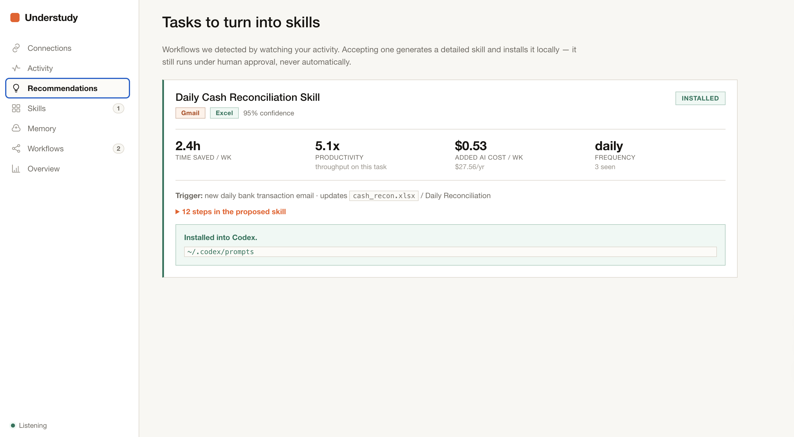
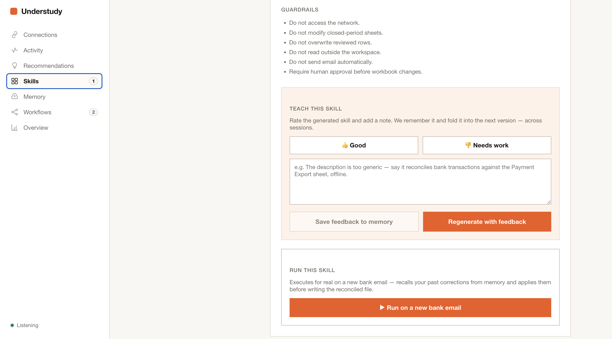
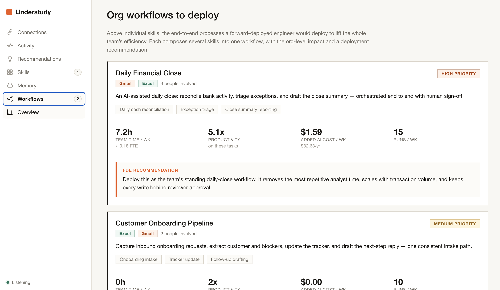
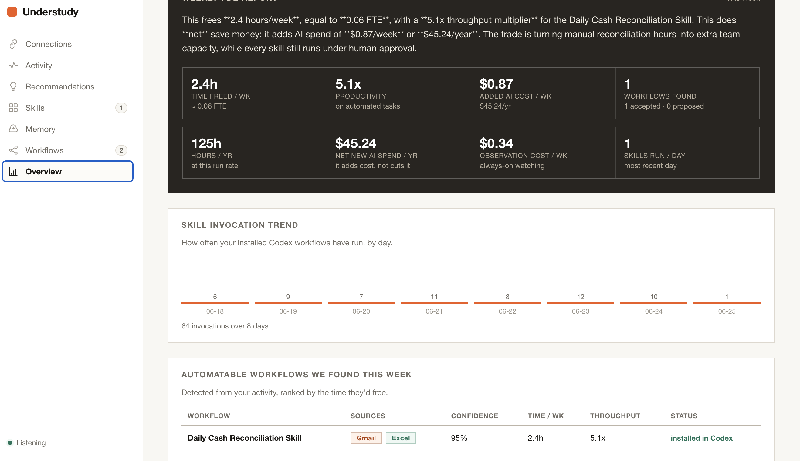

# Understudy — Codex as your company's forward-deployed engineer

Every enterprise wants AI to "just work" on their workflows. But deploying it today looks
like 2015: you hire a forward-deployed engineer, they shadow your team for weeks,
hand-build an integration, and leave. Scale that across an org? Impossible.

**Understudy is the agent that does what a forward-deployed engineer does — autonomously,
with Codex as the engineer.** Connect your tools (email, spreadsheets, Slack). It silently
observes. It detects the repeated workflows hiding in plain sight. It surfaces them **on a
dashboard** with ROI estimates. Accept one, and **Codex generates a production-grade skill**
— complete with guardrails, validation, and a live execution diagram — then **installs it
straight into Codex as a runnable `/workflow`**, ready to fire on your next trigger.

## Openable demo artifacts

No login or private workspace is needed to inspect the demo output in this repo:

- **Live demo video:** https://youtu.be/RYGWzJ3iu-g
- **Screenshots:** recommendation discovery, generated skill guardrails, org workflows, and
  weekly impact overview are shown below.
- **Generated workbook:** [`cash_recon_2026_06_15_reconciled.xlsx`](workspace/workbooks/generated/cash_recon_2026_06_15_reconciled.xlsx)
- **Draft reply:** [`cash_recon_2026_06_15_reply.eml`](workspace/mail/drafts/cash_recon_2026_06_15_reply.eml)
- **Review/audit record:** [`review_cand_daily_cash_recon_001.json`](workspace/reviews/review_cand_daily_cash_recon_001.json)

<p>
  
  
</p>
<p>
  
  
</p>

### One step beyond ambient Codex
Codex can already *watch* what you're doing — its ambient/computer-use awareness knows your
activity. Understudy goes a step further: it's a **dashboard that auto-discovers the
workflows inside that activity** and turns each one into an **installed Codex workflow**
(`~/.codex/prompts/<skill>.md` → invoke it as `/<skill>` inside Codex). Codex stops being a
thing you prompt and becomes the engineer that ships your team's automation.

### Why it's real, not a demo: it evolves with you
Correct it once — *"that $10 difference is a known timing issue"* — and it never asks again.
Rate a generated skill — *"match against the Payment Export sheet, not the raw feed"* — and
every future generation reflects that preference. **Memory isn't a feature; it's why this
agent compounds instead of resetting to zero every morning.** Long-term memory is stored in
and recalled from **HydraDB** — cross-session, cross-skill, per-reviewer namespaced (with a
local fallback if no key is set). A live **Memory tab** streams every autonomous read/write
in real time; wipe all local state and regenerate, and it still remembers, because HydraDB
does.

**Engine:** every AI call — workflow detection, skill generation, plan refinement, and
execution — runs through the **OpenAI Codex CLI** (`codex exec`, API-key mode). Deterministic
guardrails (triggers, permissions, *human approval before any write*) stay enforced in code:
Codex personalizes and does the engineering; it never weakens safety.

**Stack:** Codex · HydraDB · Python · React + Vite

---

## It monitors you — and spots what to automate

Understudy is not a passive log. Once connected, it **continuously monitors** your activity
across your tools — every email that arrives, every spreadsheet cell that changes, every
reply you draft — and **actively analyzes it for the parts that can be automated.**

- **Always-on watchers.** Connectors tail your Gmail and your workbooks, turning raw activity
  into a structured event stream (who did what, to which file, when).
- **It stitches events into episodes.** A bank email → a spreadsheet update → a summary reply
  isn't three unrelated events; Understudy joins them into one *episode* of real work.
- **It detects the repeats.** Pattern detection looks for the same episode recurring — across
  days and across people — and scores how confident it is that this is a genuine, repeatable
  workflow worth automating.
- **It hands you the opportunity, with ROI.** The moment a pattern crosses the bar, it appears
  on your dashboard as a candidate: how often it happens, the hours it's costing, the
  throughput you'd gain, the AI cost to run it. You never go hunting for what to automate — it
  surfaces the shortlist for you.

That's the difference between a logger and a forward-deployed engineer: a logger records what
happened; **Understudy diagnoses the toil hiding in plain sight and proposes the fix** — then
Codex builds it and installs it as a Codex workflow.

## The flow
1. **Observe** — watch email + spreadsheet activity; detect a repeated workflow.
2. **Discover (dashboard)** — surface it with ROI (time saved, throughput, AI cost).
3. **Generate (Codex)** — accept → Codex drafts + refines a production-grade skill.
4. **Install into Codex** — the skill lands in `~/.codex/prompts/` as a `/workflow`.
5. **Run (Codex)** — execute on a new event: read the bank attachment, reconcile, write a
   real reconciled `.xlsx` + reply draft + audit record — under human sign-off.
6. **Learn** — feedback + corrections are remembered (HydraDB) and folded into the next run.

## Inside a real workflow: daily cash reconciliation (Gmail → Excel)

This is one of the workflows Understudy discovered from raw activity, had Codex build, and
now runs end-to-end — and you can watch every step of it live on the dashboard.

**The trigger.** Every business morning a *"Daily bank transactions"* email lands in **Gmail**
with an `.xlsx` attachment. Understudy watched an analyst do the same thing with it three days
running, flagged the pattern, and Codex turned it into a skill.

**What actually runs** — each step below is a node that lights up on the Skills tab's live
execution diagram as Codex works through it:

1. **Read the bank attachment** — open the attached `bank_transactions_*.xlsx` and pull every
   row (txn id, bank amount, ERP amount).
2. **Match against the Payment Export sheet** — pair each bank row with the finance workbook
   `cash_recon.xlsx` — the reconciled ledger, not the raw feed.
3. **Compute the differences** — flag every row where bank ≠ ERP. *(e.g. `tx-1004`: $210 vs
   $200 → a $10 exception.)*
4. **Build the reconciliation preview** — fill `Match Status` / `Exception Reason` for each
   row — but write nothing yet.
5. **Pause for human approval** — nothing touches a file until you sign off. This guardrail is
   enforced in code, not by a prompt.
6. **Write the reconciled spreadsheet** — on approval, create a *new* reconciled `.xlsx`; your
   source workbook is never overwritten, reviewed rows are never clobbered.
7. **Draft the reply** — compose a summary email (*"4 matched, 1 exception…"*) as a **draft**.
   It is never sent automatically.
8. **Validate + audit** — re-open the output, confirm the guardrails held, and write an audit
   record of exactly what happened.

**And you can watch all of it, anytime, from the dashboard:**
- **Activity** streams the raw events Understudy observed (the email arriving, rows changing).
- **Skills** shows the skill's **live execution diagram** — those 8 nodes lighting up as Codex
  runs them — alongside the guardrails and the **downloadable artifacts** (the reconciled
  `.xlsx` and the `.eml` draft you can open).
- **Memory** streams every HydraDB read/write in real time.
- **Overview** rolls it into a weekly report: hours freed, throughput multiplier, AI cost.

**Why this is wild.** A human forward-deployed engineer would spend two weeks shadowing this
analyst and hand-coding the integration. Understudy discovered the workflow from raw activity,
had **Codex** write a production-grade, guardrailed version, **installed it into Codex as a
`/daily-cash-reconciliation` workflow**, and ran it — in the time it takes to read this
paragraph. And the next time `tx-1004` shows up, it already knows that's a known timing
difference, because you told it once. The dashboard means this never runs as a black box: every
observation, every step, every file it writes, and every memory it reads is on screen, live.

## Architecture
- **Backend** (Python) — `autoskill_agent/`: observe → recommend → generate → run → ops;
  `skillforge_local/`: email/Excel parsing, the **Codex engine** (`llm.py`), the
  feedback-memory layer.
- **Frontend** (React + Vite + TS) — `frontend/`: Connections, Activity, Recommendations,
  Skills (feedback + Run), Memory, Workflows, Overview.
- **Engine:** OpenAI **Codex CLI**. Optional: HydraDB for cross-session memory.

## Quickstart
```bash
# 0. Prereq: the Codex CLI (login or API key)
npm i -g @openai/codex

# 1. Key (.env.local is git-ignored)
cp .env.example .env.local            # set OPENAI_API_KEY

# 2. Backend
pip install -r requirements.txt
python -m autoskill_agent.cli skillgen-model-check     # confirms Codex is reachable
python -m autoskill_agent.api_server --host 127.0.0.1 --port 8017

# 3. Frontend (new terminal)
cd frontend && npm install && npm run dev              # proxies /api to the backend

# Reset the demo between runs:
python -m autoskill_agent.cli reset-demo --clear-memory
```
Pure-frontend preview (in-browser mock data, no backend): `cd frontend && VITE_USE_MOCKS=1 npm run dev`.

## Demo (≈2–3 min)
1. **Recommendations → Accept** → Codex generates the skill and installs it into Codex as
   `/daily-cash-reconciliation`.
2. **Skills → Run** → Codex executes it: 1 exception flagged (a known $10 timing difference),
   a real reconciled `.xlsx` produced.
3. **Teach it** — "that's a known timing difference, treat as matched."
4. **Run again** → it remembers, auto-resolves it (exceptions 1 → 0). Codex did the
   engineering; you only signed off.
